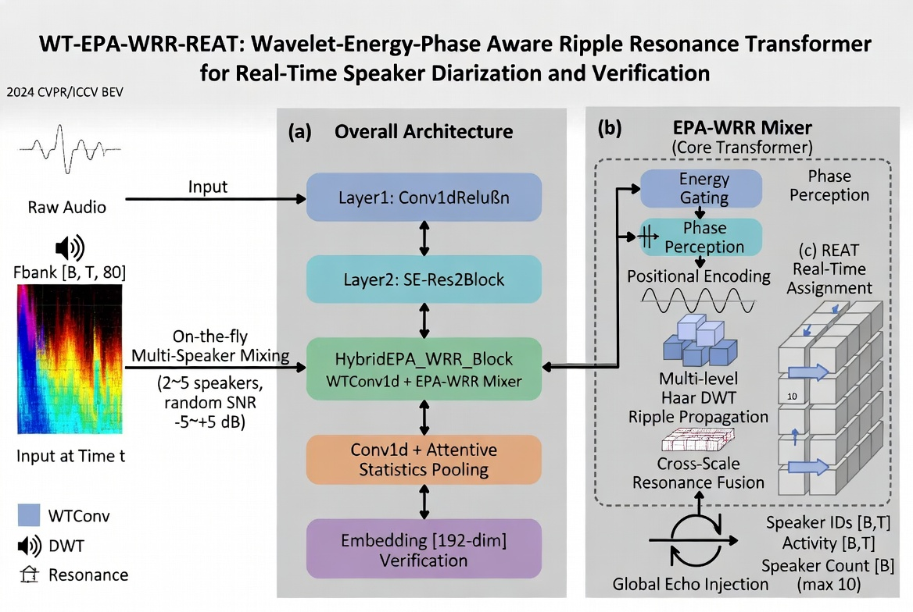

---

# 🎙️ 面向说话人感知的分离与识别系统
<div align="center">

  [](https://opensource.org/licenses/Apache-2.0)
  [](https://github.com/zhangzijie-pro/Speaker-Verification/stargazers)
  [](https://huggingface.co/zzj-pro)
  
  
  

</div>
<div align="center">
  <a href="README.md">English</a> • 
  <a href="https://github.com/zhangzijie-pro/Speaker-Verification">GitHub</a> • 
  <a href="https://huggingface.co/zzj-pro">Hugging Face</a>
</div>



---

## 项目简介

本仓库最初主要用于 **说话人验证 / 声纹识别** 方向的实验，现在正在向更实用的 **说话人感知多说话人分析系统** 演进。

当前 **dev 分支** 的目标，是让系统能够回答下面这些问题：

- **这一段 chunk 中一共有几个人在说话？**
- **谁在什么时间段说话？**
- **这一段里主要是谁在说？**
- **匿名说话人槽位如何在后续接入声纹库后映射为真实身份？**

也就是说，当前项目已经不再只是传统的两段音频相似度判断，而是在朝一个更完整的多说话人音频理解系统发展。

---

## 核心特性

- **ResoWave 主干网络**
  - 时序卷积前端
  - SE-Res2 风格模块
  - Hybrid WRR / EPA 模块
  - 注意力统计池化

- **REAT 分离头**
  - 帧级说话人嵌入
  - speaker slot 分配 logits
  - 说话活动 logits
  - 说话人数 logits

- **多任务训练**
  - PIT 槽位匹配损失
  - 说话活动检测损失
  - 说话人数分类损失
  - 帧级 prototype / 对比式监督

- **完整验证流程**
  - DER
  - activity precision / recall / F1
  - count accuracy
  - 各项损失分解

- **可扩展推理结构**
  - chunk 级推理
  - 主说话人估计
  - 预留后续声纹 bank 接口

---

## 仓库结构

```text
Speaker-Verification/
├── configs/                      # 训练配置文件
├── dataset/                      # 数据集加载逻辑
├── docs/                         # 文档与设计说明
├── processed/                    # 数据预处理与生成的 manifest
├── scripts/                      # 工具脚本
├── speaker_verification/
│   ├── checkpointing.py
│   ├── loss/
│   ├── models/
│   │   ├── head/
│   │   └── ...
│   └── ...
├── utils/                        # meters、plot、seed 等工具
├── train.py                      # 训练入口
├── verify.py                     # 验证入口
├── README.md
├── Readme_ch.md
└── requirements.txt
````

---

## 当前目标

当前 dev 分支的目标，是针对一个混合说话人的 chunk，输出：

* **说话人数**
* **说话时间段**
* **主说话人**
* 后续可用于对接 **speaker bank / 声纹库** 的 speaker-slot prototype

因此，这个分支更适合被理解为：

> 一个面向多说话人音频理解的系统
> 而不是只做 pairwise speaker verification 的示例仓库

---

## 模型结构

### 1. 主干：`ResoWave`

输入形状：

```python
[B, T, 80]
```

输出：

* 全局 embedding
* 用于分离头的帧级特征

主要组成模块：

* `Conv1dReluBn`
* `SE_Res2Block`
* `HybridEPA_WRR_Block`
* `AttentiveStatsPool`

---

### 2. 分离头：`REAT_DiarizationHead`

分离头输出：

* `frame_embeds: [B, T, D]`
* `slot_logits: [B, T, K]`
* `activity_logits: [B, T]`
* `count_logits: [B, K]`

其中：

* `T` = 帧数
* `D` = 帧级 embedding 维度
* `K` = 一个 chunk 中允许的最大说话人数

---

### 3. 多任务损失

当前训练目标由以下部分组成：

* **PIT loss**：用于 speaker-slot 分配
* **activity loss**：用于说话 / 非说话检测
* **count loss**：用于说话人数分类
* **frame-level prototype / contrastive loss**：用于增强帧级 speaker embedding 的区分性

这样做的目的，是避免把一个混合说话人的 chunk 强行绑定成单一说话人标签。

---

## 数据流程

当前训练主要基于 **静态混合说话人 chunk**。

一个训练样本通常包含：

* 声学特征张量
* 说话人槽位 target matrix
* 说话活动 target
* 说话人数 target
* 有效帧 mask

训练中常用字段包括：

* `fbank`
* `target_matrix`
* `target_activity`
* `target_count`
* `valid_mask`

数据预处理与 manifest 生成逻辑位于：

* `processed/`
* `dataset/`

---

## 安装

```bash
git clone https://github.com/zhangzijie-pro/Speaker-Verification.git
cd Speaker-Verification
pip install -r requirements.txt
```

---

## 训练

默认训练命令：

```bash
python train.py
```

也可以使用 Hydra 覆盖参数：

```bash
python train.py train.epochs=100 train.lr=3e-4 model.max_mix_speakers=4
```

示例配置：

```yaml
seed: 1234
device: "cuda"
out_dir: "outputs"

data:
  out_dir: "processed/static_mix_cnceleb2"
  train_manifest: "train_manifest.jsonl"
  val_manifest: "val_manifest.jsonl"
  crop_sec: 4.0

model:
  feat_dim: 80
  channels: 512
  emb_dim: 192
  max_mix_speakers: 4

loss:
  lambda_pit: 1.0
  lambda_act: 1.0
  lambda_cnt: 0.2
  lambda_frm: 0.5
  pos_weight: 2.0
  pit_pos_weight: 1.5

train:
  epochs: 100
  batch_size: 16
  num_workers: 0
  lr: 3.0e-4
  weight_decay: 3.0e-5
  grad_clip: 5.0
  amp: true
  val_batches: 100
  activity_threshold: 0.5
```

---

## 训练输出

训练过程中通常会生成：

* `outputs/last.pt`
* `outputs/best.pt`
* `outputs/history.json`
* 日志文件，例如：

  * `outputs/train_YYYYMMDD_HHMMSS.log`

当前 `best.pt` 的选择依据是 **DER 最低**。

---

## 验证

示例：

```bash
python verify.py \
  --ckpt outputs/best.pt \
  --data_out_dir processed/static_mix_cnceleb2 \
  --manifest val_manifest.jsonl \
  --crop_sec 4.0 \
  --feat_dim 80 \
  --channels 512 \
  --emb_dim 192 \
  --max_mix_speakers 4 \
  --lambda_pit 1.0 \
  --lambda_act 1.0 \
  --lambda_cnt 0.2 \
  --lambda_frm 0.5 \
  --pos_weight 2.0 \
  --pit_pos_weight 1.5 \
  --batch_size 16 \
  --num_workers 0 \
  --device cuda \
  --max_batches 100 \
  --activity_threshold 0.5
```

常见输出指标：

* `val_loss`
* `pit_loss`
* `act_loss`
* `cnt_loss`
* `frm_loss`
* `DER`
* `CountAcc`
* `ActPrecision`
* `ActRecall`
* `ActF1`

---

## 推理

当前推理目标是对单个 chunk 的声学特征进行分析。

输出包括：

* 预测说话人数
* 帧级 speaker-slot 分配
* 说话活动
* 说话时间段
* 主说话人
* 每个 slot 的 prototype

示例：

```python
from infer_realtime import load_model, infer_chunk

model = load_model(
    ckpt_path="outputs/best.pt",
    device="cuda",
    feat_dim=80,
    channels=512,
    emb_dim=192,
    max_mix_speakers=4,
)

result = infer_chunk(
    model=model,
    fbank=fbank_tensor,   # [T,80] 或 [1,T,80]
    device="cuda",
    activity_threshold=0.5,
    frame_shift_sec=0.01,
)
```

示例输出：

```python
{
    "num_speakers": 3,
    "dominant_speaker": "slot_0",
    "activity_ratio": 0.81,
    "slots": [
        {
            "slot": 0,
            "name": "unknown",
            "score": None,
            "is_known": False,
            "num_frames": 210,
            "duration_sec": 2.1
        }
    ],
    "segments": [
        {
            "slot": 0,
            "start_sec": 0.12,
            "end_sec": 1.54,
            "duration_sec": 1.42,
            "name": "unknown"
        }
    ]
}
```

---

## 声纹库 / Speaker Bank 对接

当前推理结构已经预留了 speaker bank 接口，后续可以接入你已有的声纹识别模型或外部声纹库。

建议的流程是：

1. 使用独立的说话人验证 / 声纹模型
2. 用注册语音建立 speaker bank
3. 从 diarization 结果中提取 slot prototype
4. 将 slot prototype 与 speaker bank 做匹配
5. 将匿名 slot 转换为真实身份

推荐接口形式：

```python
class SpeakerBankBase:
    def identify(self, embedding):
        return {
            "name": "zhangsan",
            "score": 0.87,
            "is_known": True,
        }
```

这样当前模型已经可以输出：

* **有几个人说话**
* **每个 slot 在什么时间段活跃**
* **谁是主说话人**

而未来在接入声纹库后，可以进一步输出：

* **具体是哪一个已知说话人**

而不需要重写整个系统。

---

## 当前状态

### 已经比较稳定的部分

* 训练流程稳定
* 基于 DER 的 best checkpoint 选择
* 说话活动检测表现较强
* 说话人数估计较稳定
* 验证链路清晰
* chunk 级推理结构已打通

### 仍在持续优化的部分

* 更强的 frame-level speaker discrimination
* 更低的 DER
* 更稳定的 slot 分配
* diarization 输出与 identity retrieval 的更好衔接
* speaker bank 的真实接入

---

## 分支说明

* **dev**：当前以 diarization 为中心的开发分支
* **release**：更早期、更偏 speaker verification / voiceprint recognition 的分支

如果你更关注早期的声纹验证方向，可以查看 `release` 分支。当前 release 分支首页仍然更明确地将仓库描述为 speaker verification / voiceprint recognition 项目。 ([GitHub][2])

---

## 计划路线

* [x] 多任务 diarization 训练
* [x] 基于 DER 的验证
* [x] chunk 级推理
* [x] 主说话人估计
* [ ] speaker bank 对接
* [ ] 真实身份输出
* [ ] 麦克风流式输入
* [ ] 面向下游系统的部署接口

---

## 📜 开源协议

本项目采用 **Apache License 2.0** 开源协议。  
CN-Celeb 数据集遵循其原始许可协议和使用条款。

---

## 🙋 说明
本项目正围绕更实际的说话人感知 AI / 机器人音频理解场景持续迭代，包括未来的声纹库接入、实时音频管线和下游智能系统联动。
本仓库主要用于：

- 学习说话人验证系统
- 科研复现与二次开发

**不是开箱即用的商用系统**。
